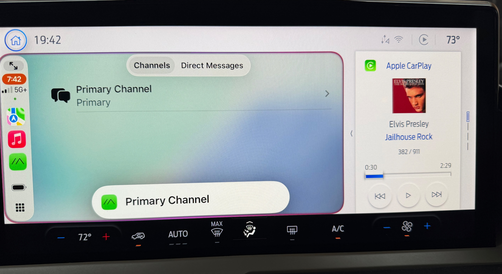
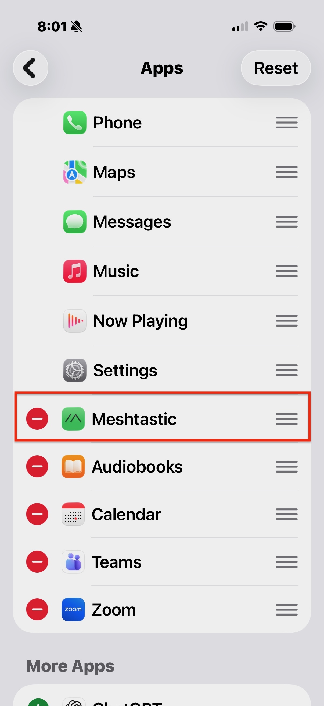
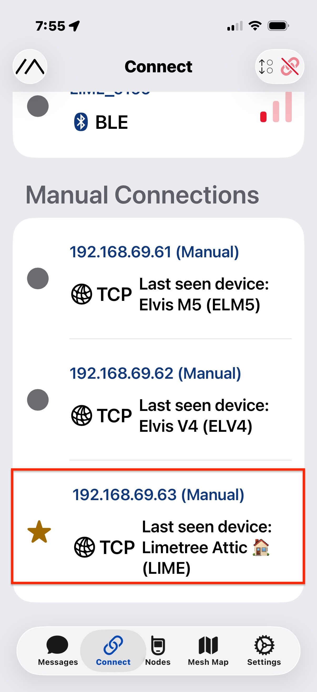
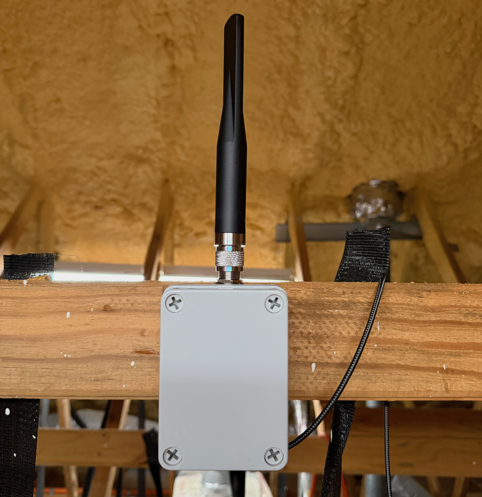

# meshtastic-remote-access
Meshtastic CarPlay and VPN Remote Access

SUMMARY

April 2026, the Meshtastic iOS app added support for CarPlay.  This allows you to use Siri to dictate and send messages to public and private channels, and direct messages. 

If you have an ESP32-S3 based Meshtastic device with WiFi capability, such as the Heltec V4, connected to your home network and a self hosted VPN, you can connect the Meshtastic iOS app remotely to a Meshtastic device.

There are no Meshtastic app plans to add support for Android Auto that I am aware of, in spite of repeated requests to do so. 

Sadly, MeshCore currently does not have a TCP/IP stack, thus does not support WiFi, nor are their plans to add CarPlay and Android Auto support.  

NOTE: I have been unable to get Siri to dictate messages using third party CarPlay screens, such as the CarPodGo T3, since it uses the OEM voice recognition instead of Siri

CARPLAY PREREQUISITES

* Vehicle equipped with native CarPlay support
* iOS or iPadOS device with CarPlay enabled
* Meshtastic device connected via BlueTooth
* Meshtastic app enabled in CarPlay

REMOTE PREREQUISITES

* Meshtastic device with WiFi capability, such as the Heltec V4
* Meshtastic device connected to your home WiFi with a static IP reservation in your router/firewall DHCP server
* A self hosted VPN on your home network
* Meshtastic app configured to manually connect to your node via it's IP address.  

SUGGESTED ATTIC NODE

* [Heltec V4 w/o Display](https://heltec.org/project/wifi-lora-32-v4/)
* [Alfa Antenna](https://store.rokland.com/collections/all-helium-antennnas/products/alfa-aoa-915-5acm-5-dbi-omni-outdoor-915mhz-802-11ah-mini-antenna-for-lora-halow-application) 
* [UFL IPEX/IPX Mini PCI to N-Female Bulkhead Pigtail Cable Extension](https://store.rokland.com/products/uflipex-ipx-mini-pci-to-n-female-bulkhead-pigtail-cable-extension-rg178)
* [Watertight Project Box](https://www.amazon.com/dp/B09F937WGY)

SUGGESTED FIREWALL

I personally run pfSense on a x86_64 Mini-PC, which supports static IP reservations and has a native Tailscale package.  pfSense and Mini-PC are not on the FCC list of banned consumer routers.  

* [New/Used Protectli Vault](https://protectli.com/product-comparison/)
* [pfSense Open Source Enterprise Firewall Software](https://pfsense.org)

SUGGESTED VPN

You only need a single instance of Tailscale running on or behind your firewall, if you enable advertise subnet routes.  That way you can access any IP based device on your home network remotely without opening ports on your firewall.  Tailscale has a free tier with up to 6 users, unlimited number of devices, will traverse any level of NAT, including CGNAT. Clients for every OS distribution on earth, including Apple TV

* [Tailscale MESH VPN](https://tailscale.com)

